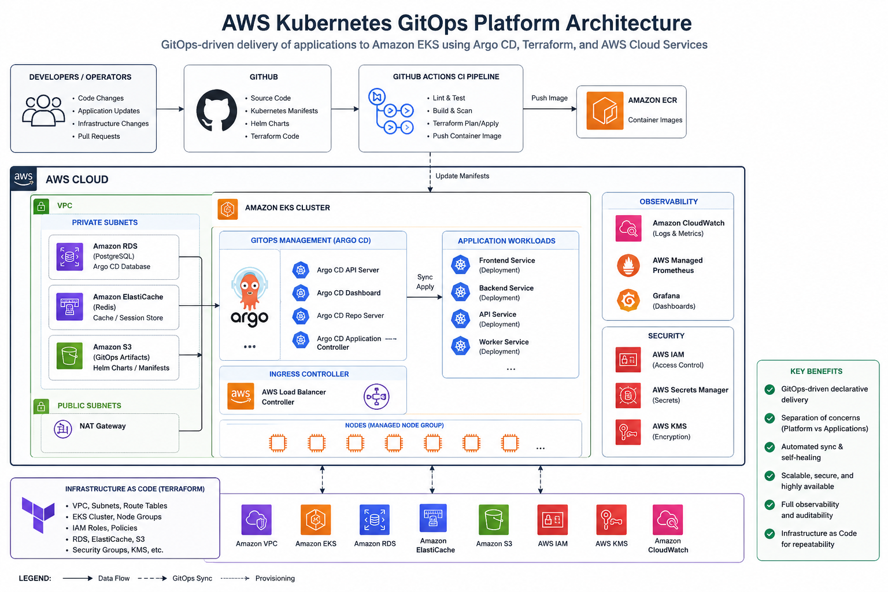

# Kubernetes Platform on AWS

This project implements a Kubernetes GitOps platform for deploying and managing containerized applications using DevOps practices. It combines Terraform, Amazon EKS, Docker, Kubernetes, Helm, and Argo CD to automate infrastructure provisioning and application delivery, The entire platform is designed to be managed through Infrastructure as Code (IaC) and a GitOps workflow.

## Architecture

---

## Technologies used:
- **Cloud Provider**: AWS
- **Container Orchestration**: Amazon EKS (Elastic Kubernetes Service)
- **Infrastructure as Code (IaC)**: Terraform for provisioning the VPC and EKS cluster.
- **GitOps Controller**: Argo CD, which syncs the cluster's state from the manifests in this Git repo.
- **Application Source**: A simple Node.js application, containerized with Docker.
- **Observability**: A full "PLG" stack with **P**rometheus (metrics), **L**oki (logs), and **G**rafana (dashboards).

---

## Project Structure

- **Application Code (`/app-source-code`)**
  - A simple Node.js microservice used as the sample application for deployment.
  - **`app.js`** – A basic "Hello, World" web server that returns a JSON response.
  - **`Dockerfile`** – A multi-stage Dockerfile for building a lightweight, production-ready container image.

- **Infrastructure as Code (`/terraform`)**
  - Contains the Terraform code used to provision the AWS infrastructure.
  - **`main.tf`** – Defines the AWS VPC, subnets, and Amazon EKS cluster using official AWS Terraform modules.
  - **`variables.tf`** – Defines configurable values such as the AWS region and cluster name.
  - **`outputs.tf`** – Provides important deployment outputs, including the command for configuring `kubectl`.

- **GitOps Manifests (`/gitops-manifests`)**
  - **`root-app.yaml`** – The main Argo CD application that bootstraps the other applications.
  - **`apps/templates/`** – Contains Argo CD `Application` definitions for the `sample-app` and monitoring stack.
  - **`charts/sample-app`** – Contains the Helm chart for deploying the sample Node.js application.
  - **`deployment.yaml`** and **`service.yaml`** – Define how the application runs and is exposed within the Kubernetes cluster.

---

## How It Works

1.  **Infrastructure Provisioning**: A developer runs `terraform apply` in the `/terraform` directory to create the EKS cluster. This is typically a one-time setup step.
2.  **Argo CD Installation**: Argo CD is manually installed onto the cluster. The `root-app.yaml` manifest is then applied, pointing Argo CD to this repository.
3.  **Application Deployment (GitOps)**:
    - When a developer commits and pushes a change to the `/gitops-manifests/charts/sample-app` directory (e.g., updating the image version in `deployment.yaml`), Argo CD detects the change in Git.
    - Argo CD automatically compares the new state in Git with the running state in the cluster and applies the changes, deploying the new version of the application. **There is no manual `kubectl apply` needed for applications.**
4.  **Observability Deployment**: In the same way, the Prometheus and Grafana stack is deployed and configured just by having its Argo CD application manifest present in the Git repository.
---
